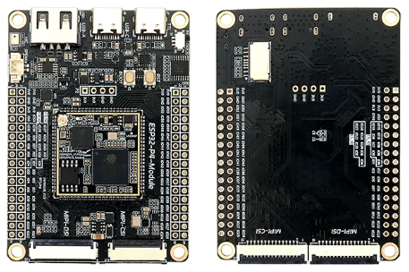
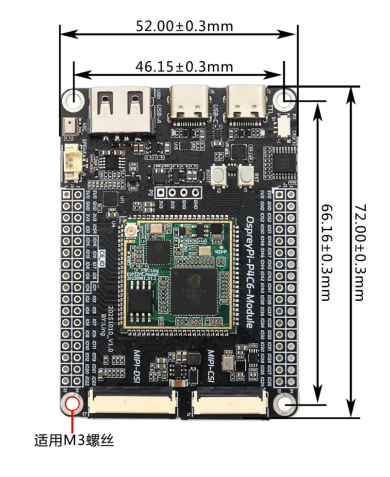
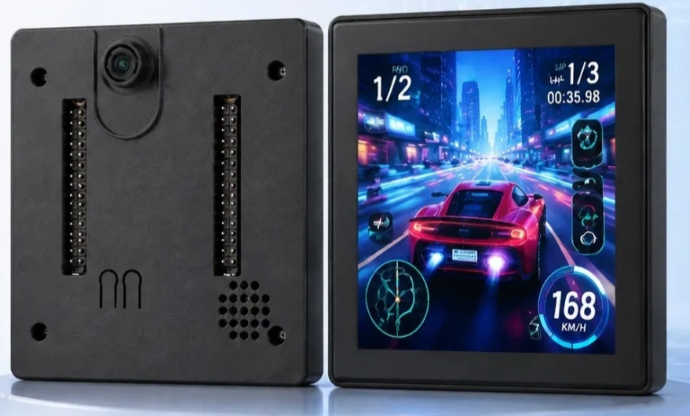
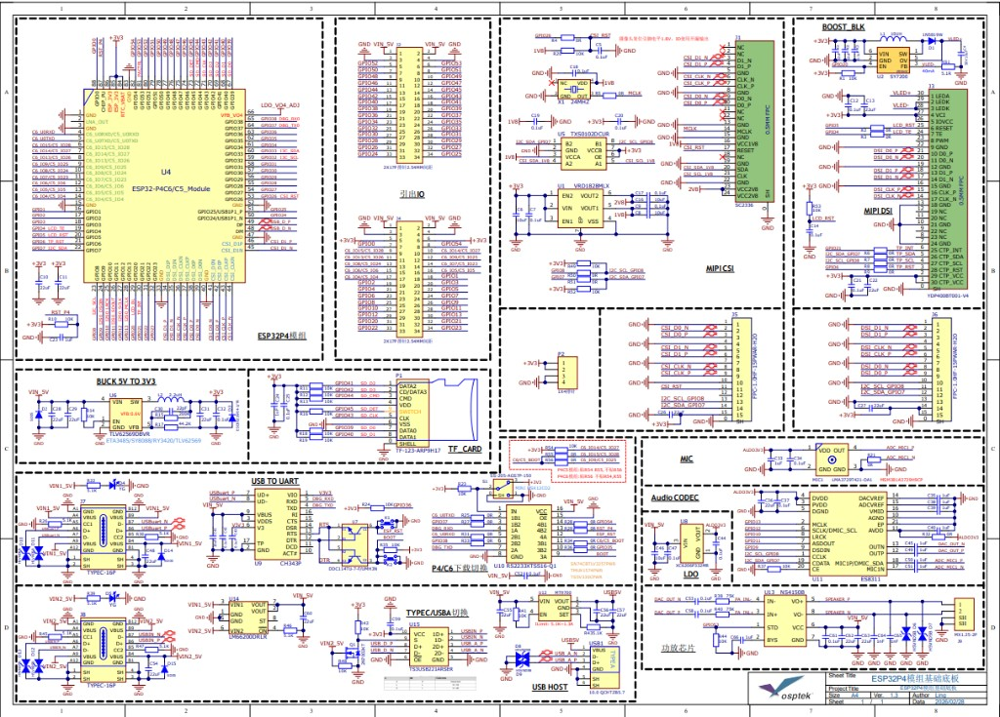

<p align="left"></p>

<h1 align="center">OSPTEK ESP32-P4C5-Module Dev Board</h1>

<p align="center"><b>Ready to Use · Multi-Function Expansion · Full I/O Breakout</b></p>

<p align="center">English | <a href="./README.md">简体中文</a></p>

<p align="center">
  
  
  
  
  
</p>

<p align="center"></p>

## Contents

- [Overview](#overview)
- [Features](#features)
- [Applications](#applications)
- [Specifications](#specifications)
- [Hardware Resources](#hardware-resources)
- [Core Board](#core-board)
- [Compatible Displays](#compatible-displays)
- [Compatible Cameras](#compatible-cameras)
- [Get Started](#get-started)
- [Repository Structure](#repository-structure)
- [Documentation](#documentation)
- [Where to Buy](#where-to-buy)
- [Support](#support)

---

## Overview

The OSPTEK ESP32-P4C5-Module Dev Board is a multi-function development platform built around the
**ESP32-P4C5 Core Board**. The carrier expands the core board with camera, display, audio, and USB
interfaces plus multi-path power protection, and breaks out 55 programmable GPIOs from ESP32-P4 and
9 GPIOs from ESP32-C5 via 2×2×17 pin headers. You can evaluate and develop without designing your
own carrier board.

The onboard ESP32-P4 integrates two high-performance (HP) RISC-V cores and one low-power (LP) core,
running at up to 360 MHz, with a JPEG codec, Pixel Processing Accelerator (PPA), Image Signal
Processor (ISP), and H.264 video encoder. ESP32-C5 provides Wi-Fi 6 (2.4/5 GHz dual-band),
Bluetooth 5 (LE), and IEEE 802.15.4 (Zigbee / Thread) wireless connectivity.

## Features

- 🚀 **Ready to Use**: core board + carrier in one — power on and start evaluating
- ⚡ **High-Performance Dual-Core**: ESP32-P4 dual-core RISC-V, up to 360 MHz, 16 MB Flash + 32 MB PSRAM
- 🎨 **Rich Multimedia**: JPEG codec, H.264 encoding, PPA, and ISP for image and video workloads
- 📶 **Wireless Connectivity**: Wi-Fi 6 (2.4/5 GHz dual-band), Bluetooth 5 (LE), IEEE 802.15.4 (Zigbee / Thread)
- 📷 **Camera Interfaces**: MIPI-CSI 24P + 15P Raspberry Pi–compatible connector; works with SC2336
- 🖥️ **Display Interfaces**: MIPI-DSI 30P + 15P Raspberry Pi–compatible connector; supports YDP400BT001-V4
- 🔊 **Complete Audio Path**: ES8311 codec + NS4150 3 W Class-D amp + onboard silicon mic
- 🔌 **Rich USB**: 2 × Type-C (data / debug) + USB-A Host, with high-speed USB 2.0 switching
- 🛠️ **Driver-Free Debug**: onboard CH343P USB-UART; toggle switch selects ESP32-P4 or ESP32-C5 flashing target
- 📍 **Full Pin Breakout**: 2×2×17 headers expose 55 ESP32-P4 GPIOs and 9 ESP32-C5 GPIOs
- 🛡️ **Power Protection**: dual ideal diodes for reverse-current blocking; USB-A output with OCP / SCP

## Applications

- 🖥️ HMI (human-machine interface)
- 📷 Vision and image capture
- 🎙️ Voice interaction and audio processing
- 📹 Video encoding and streaming
- 🏠 Smart home control panels
- 🏭 Industrial control and monitoring
- 🤖 Robotics
- 🧠 AIoT edge computing
- 🔌 USB host expansion

## Specifications

### MCU & Memory

| Item       | Specification                                      |
| ---------- | -------------------------------------------------- |
| Core Board | ESP32-P4C5 Core Board (88-pin stamp hole)          |
| Main Chip  | Espressif ESP32-P4 (2 × HP RISC-V + 1 × LP core)   |
| Clock      | Up to 360 MHz                                      |
| ROM        | 128 KB HP ROM + 16 KB LP ROM                       |
| SRAM       | 768 KB HP L2MEM + 32 KB LP SRAM + 8 KB TCM         |
| Flash      | 16 MB serial NOR Flash                             |
| PSRAM      | 32 MB (in-package on ESP32-P4)                     |

### Wireless

| Item          | Specification                             |
| ------------- | ----------------------------------------- |
| Wireless Chip | ESP32-C5                                  |
| Wi-Fi         | Wi-Fi 6 (2.4 / 5 GHz dual-band)           |
| Bluetooth     | Bluetooth 5 (LE)                          |
| Other         | IEEE 802.15.4 (Zigbee / Thread)           |
| Antenna       | IPEX-1 connector on the core board        |

### Camera & Display

| Item              | Specification                                                    |
| ----------------- | ---------------------------------------------------------------- |
| Camera (front)    | MIPI-CSI 24P 0.5 mm top-contact, supports SC2336                 |
| Camera (back)     | MIPI-CSI 15P 1.0 mm top-contact, Raspberry Pi–compatible         |
| Display (front)   | MIPI-DSI 30P 0.5 mm top-contact, supports YDP400BT001-V4         |
| Display (back)    | MIPI-DSI 15P 1.0 mm top-contact, Raspberry Pi–compatible         |
| Backlight Driver  | SY7200 boost constant-current for DSI panels                     |

### Audio

| Item            | Specification                                      |
| --------------- | -------------------------------------------------- |
| Codec           | ES8311 (low-power mono codec)                      |
| Amplifier       | NS4150 (3 W mono Class-D)                          |
| Microphone      | LMA3729T421-OA1 silicon mic (onboard)              |
| Speaker Header  | MX1.25-2P                                          |

### USB & Debug

| Item             | Specification                                                         |
| ---------------- | --------------------------------------------------------------------- |
| Data Port        | Type-C × 1, high-speed USB 2.0 (480 Mbps)                             |
| Debug Port       | Type-C × 1, onboard CH343P USB-UART                                   |
| USB Host         | USB-A × 1                                                             |
| Path Switch      | TS3USB221ARSER 1:2 mux between Type-C and USB-A                       |
| Flash Target     | Slide switch: up = ESP32-P4, down = ESP32-C5                          |

### Power Management

| Item           | Specification                                                       |
| -------------- | ------------------------------------------------------------------- |
| Main Supply    | 5 V in, TLV62569 buck to 3.3 V                                      |
| Reverse Protect| LM66200DRLR dual ideal diode (ORing)                                |
| USB-A Output   | MT9700 adjustable current-limit power switch with OCP / SCP         |
| Aux Rails      | Onboard 1.8 V / 2.8 V LDOs for camera and other peripherals         |

### Expansion

| Item          | Specification                                                  |
| ------------- | -------------------------------------------------------------- |
| Headers       | 2 × 2×17P, 2.54 mm pitch                                       |
| Broken-out IO | 55 programmable GPIOs (ESP32-P4) + 9 GPIOs (ESP32-C5)          |
| Storage       | Onboard TF (microSD) slot                                      |

## Hardware Resources

### Onboard Resources

| Device / Interface | Description                                                    |
| ------------------ | -------------------------------------------------------------- |
| Core Board         | ESP32-P4C5 Core Board (stamp-hole, 88 pins)                    |
| USB-UART           | CH343P, driver-free debug serial                               |
| Flash Switch       | Slide switch + RS2233XTSS16-Q1 4-ch SPDT analog switch         |
| Status LED         | Onboard indicator                                              |
| Audio Codec        | ES8311                                                         |
| Amplifier          | NS4150 (3 W Class-D)                                           |
| Microphone         | LMA3729T421-OA1 silicon mic (onboard)                          |
| Speaker Header     | MX1.25-2P                                                      |
| Camera             | Front MIPI-CSI 24P, back MIPI-CSI 15P (Raspberry Pi–compatible)|
| Display            | Front MIPI-DSI 30P, back MIPI-DSI 15P (Raspberry Pi–compatible)|
| Backlight Driver   | SY7200 boost constant-current                                  |
| USB                | Type-C × 2 (data / debug) + USB-A × 1 (Host)                   |
| TF Slot            | microSD                                                        |
| Buttons            | RST (reset), BOOT (download mode)                              |
| Headers            | 2 × 2×17P, 2.54 mm pitch                                       |

### Back Side Interfaces

<p align="center"></p>

Two 15P 1.0 mm MIPI connectors on the back are Raspberry Pi cable–compatible; the TF card slot is
near the top of the back side.

### Dimensions

<p align="center"></p>

| Item            | Dimension                         |
| --------------- | --------------------------------- |
| Board Size      | 72.00 × 52.00 mm (±0.3 mm)        |
| Mounting Pitch  | 66.16 × 46.15 mm (±0.3 mm)        |
| Mounting Holes  | 4 × M3                            |

### Enclosure

Optional **4-inch** front/back enclosure (V1.0) for this board with a matching display. The back shell keeps header windows and a speaker grille; the top has a camera cutout.

<p align="center"></p>

| File | Description |
| ---- | ----------- |
| [Front shell STEP V1.0](./docs/ESP32-P4C5-Module-Enclosure-Front-4inch-V1.0.STEP) | 4-inch front |
| [Back shell STEP V1.0](./docs/ESP32-P4C5-Module-Enclosure-Back-4inch-V1.0.STEP) | 4-inch back |

### Schematic

<p align="center"></p>

Full schematic PDF: [docs/ESP32P4模组基础底板V1.3.pdf](./docs/ESP32P4模组基础底板V1.3.pdf).

### Hardware Revisions

| Date     | Rev  | Changes                                                                                          |
| -------- | ---- | ------------------------------------------------------------------------------------------------ |
| 20251023 | V1.1 | Initial release                                                                                  |
| 20251024 | V1.2 | PCB optimization; added input TVS                                                                |
| 20260228 | V1.3 | MIPI-CSI reset pull-up changed to 1.8 V (open-drain IO recommended); carrier compatible with P4C6 and P4C5 modules |

## Core Board

This dev board carries the **ESP32-P4C5 Core Board** (`esp32-p4c5-core-board`) with all core-board
pins broken out. Specs and pinout details are in its dedicated repositories:

- GitHub: <https://github.com/osptek/esp32-p4c5-core-board>
- Gitee: <https://gitee.com/osptek/esp32-p4c5-core-board>

## Compatible Displays

Displays are driven over **MIPI-DSI** (front 30P 0.5 mm / back 15P 1.0 mm Raspberry Pi–compatible).
The following models can be used with this board; see each repository for details:

| Size | Resolution | Type | Driver IC | GitHub | Gitee |
| ---- | ---------- | ---- | --------- | ------ | ----- |
| 1.6″ | 480×480 | AMOLED | ST7802 | [Link](https://github.com/osptek/1.6-amoled-480x480-mipi-st7802) | [Link](https://gitee.com/osptek/1.6-amoled-480x480-mipi-st7802) |
| 1.73″ | 466×466 | AMOLED | CO5300 | [Link](https://github.com/osptek/1.73-amoled-466x466-mipi-co5300) | [Link](https://gitee.com/osptek/1.73-amoled-466x466-mipi-co5300) |
| 2.0″ | 460×460 | AMOLED | CO5300 | [Link](https://github.com/osptek/2.0-amoled-460x460-mipi-co5300) | [Link](https://gitee.com/osptek/2.0-amoled-460x460-mipi-co5300) |
| 2.1″ | 480×480 | TFT | ST77922 | [Link](https://github.com/osptek/2.1-tft-480x480-mipi-st77922) | [Link](https://gitee.com/osptek/2.1-tft-480x480-mipi-st77922) |
| 2.13″ | 410×502 | AMOLED | ST7801 | [Link](https://github.com/osptek/2.13-amoled-410x502-mipi-st7801) | [Link](https://gitee.com/osptek/2.13-amoled-410x502-mipi-st7801) |
| 2.76″ | 480×480 | TFT | ST7701 | [Link](https://github.com/osptek/2.76-tft-480x480-mipi-st7701) | [Link](https://gitee.com/osptek/2.76-tft-480x480-mipi-st7701) |
| 2.95″ | 480×854 | TFT | ST7701 | [Link](https://github.com/osptek/2.95-tft-480x854-mipi-st7701) | [Link](https://gitee.com/osptek/2.95-tft-480x854-mipi-st7701) |
| 3.13″ | 376×960 | TFT | GC9503CV | [Link](https://github.com/osptek/3.13-tft-376x960-mipi-gc9503cv) | [Link](https://gitee.com/osptek/3.13-tft-376x960-mipi-gc9503cv) |
| 3.19″ | 262×928 | AMOLED | CO6300 | [Link](https://github.com/osptek/3.19-amoled-262x928-mipi-co6300) | [Link](https://gitee.com/osptek/3.19-amoled-262x928-mipi-co6300) |
| 3.42″ | 258×960 | TFT | AXS15231B | [Link](https://github.com/osptek/3.42-tft-258x960-mipi-axs15231b) | [Link](https://gitee.com/osptek/3.42-tft-258x960-mipi-axs15231b) |
| 3.82″ | 280×1020 | TFT | AXS15231B | [Link](https://github.com/osptek/3.82-tft-280x1020-mipi-axs15231b) | [Link](https://gitee.com/osptek/3.82-tft-280x1020-mipi-axs15231b) |
| 3.95″ | 480×480 | TFT | ST7102 | [Link](https://github.com/osptek/3.95-tft-480x480-mipi-st7102) | [Link](https://gitee.com/osptek/3.95-tft-480x480-mipi-st7102) |
| 3.97″ | 480×800 | TFT | GC9503CV | [Link](https://github.com/osptek/3.97-tft-480x800-mipi-gc9503cv) | [Link](https://gitee.com/osptek/3.97-tft-480x800-mipi-gc9503cv) |
| 4.0″ | 720×720 | TFT | ST7703 | [Link](https://github.com/osptek/4.0-tft-720x720-mipi-st7703) | [Link](https://gitee.com/osptek/4.0-tft-720x720-mipi-st7703) |
| 4.3″ | 480×800 | TFT | ST7102 | [Link](https://github.com/osptek/4.3-tft-480x800-mipi-st7102) | [Link](https://gitee.com/osptek/4.3-tft-480x800-mipi-st7102) |
| 4.58″ | 424×1280 | TFT | JD9261 | [Link](https://github.com/osptek/4.58-tft-424x1280-mipi-jd9261) | [Link](https://gitee.com/osptek/4.58-tft-424x1280-mipi-jd9261) |
| 10.1″ | 800×1280 | TFT | JD9366 | [Link](https://github.com/osptek/10.1-tft-800x1280-mipi-jd9366) | [Link](https://gitee.com/osptek/10.1-tft-800x1280-mipi-jd9366) |

## Compatible Cameras

Cameras connect over **MIPI-CSI** (front 24P 0.5 mm / back 15P 1.0 mm Raspberry Pi–compatible).
The following models can be used with this board:

| Model  | Interface | GitHub | Gitee |
| ------ | --------- | ------ | ----- |
| SC2336 | MIPI CSI  | [Link](https://github.com/osptek/camera-mipi-csi-sc2336) | [Link](https://gitee.com/osptek/camera-mipi-csi-sc2336) |
| OV2710 | MIPI CSI  | [Link](https://github.com/osptek/camera-mipi-csi-ov2710) | [Link](https://gitee.com/osptek/camera-mipi-csi-ov2710) |

## Get Started

This board is developed with the official **ESP-IDF** ecosystem. For environment setup and flashing,
see Espressif docs:

- [ESP-IDF Get Started · ESP32-P4](https://docs.espressif.com/projects/esp-idf/en/latest/esp32p4/get-started/)
- [ESP-IDF 快速入门 · ESP32-P4（中文）](https://docs.espressif.com/projects/esp-idf/zh_CN/latest/esp32p4/get-started/)

## Repository Structure

```
esp32-p4c5-module-dev-board/
├── README.md          # Chinese product docs
├── README_EN.md       # English product docs (this file)
├── docs/              # User guide, schematic, enclosure STEP, camera/antenna files
└── images/            # Images used by the README
```

## Documentation

### Product Docs

- [ESP32-P4-Module User Guide](./docs/ESP32-P4-Module_使用指南2026.03.26.pdf)
- [ESP32-P4 Module Carrier Schematic V1.3](./docs/ESP32P4模组基础底板V1.3.pdf)
- [4-inch enclosure front STEP V1.0](./docs/ESP32-P4C5-Module-Enclosure-Front-4inch-V1.0.STEP)
- [4-inch enclosure back STEP V1.0](./docs/ESP32-P4C5-Module-Enclosure-Back-4inch-V1.0.STEP)

### Peripheral Docs

- [SC2336 Datasheet](./docs/SC2336_数据手册_V0.7(1).pdf)
- [ESP32-P4 Camera Materials](./docs/ESP32-P4-Camera.pdf)
- [C5 Dual-Band Antenna Materials](./docs/C5双频天线%20.pdf)

### Chip Docs (Espressif)

- [ESP32-P4 Datasheet v1.3](https://documentation.espressif.com/esp32-p4-chip-revision-v1.3_datasheet_en.html)
- [ESP32-P4 Technical Reference Manual v1.3](https://documentation.espressif.com/esp32-p4-chip-revision-v1.3_technical_reference_manual_en.pdf)
- [ESP32-P4 Product Page](https://www.espressif.com/en/producttype/esp32-p4)
- [ESP32-C5 Datasheet](https://documentation.espressif.com/esp32-c5_datasheet_en.html)
- [ESP32-C5 Product Page](https://www.espressif.com/en/products/socs/esp32-c5)

### Development Guides

- [ESP-IDF Programming Guide · ESP32-P4](https://docs.espressif.com/projects/esp-idf/en/latest/esp32p4/index.html)
- [ESP-IDF Get Started · ESP32-P4](https://docs.espressif.com/projects/esp-idf/en/latest/esp32p4/get-started/)

## Where to Buy

<p align="center">
  <a href="https://www.aliexpress.com/store/1105701619"></a>
  &nbsp;&nbsp;
  <a href="https://shop110742373.taobao.com/"></a>
</p>

**International (AliExpress)**

- Store: [OSPTEK Official Store](https://www.aliexpress.com/store/1105701619)

**China (Taobao)**

- Store: [鱼鹰光电工厂店](https://shop110742373.taobao.com/)

---

## Support

For technical questions or business inquiries, feel free to contact us:

- 📧 Technical Support / Sales: <luyu@osptek.com>
- 🐧 QQ Technical Group: **985881096**
- 🌐 Website: <https://osptek.com/>
- Feel free to open an Issue in this repository if you have any questions

---

<p align="center"><sub>© 2026 OSPTEK · Licensed under CC BY 4.0</sub></p>
